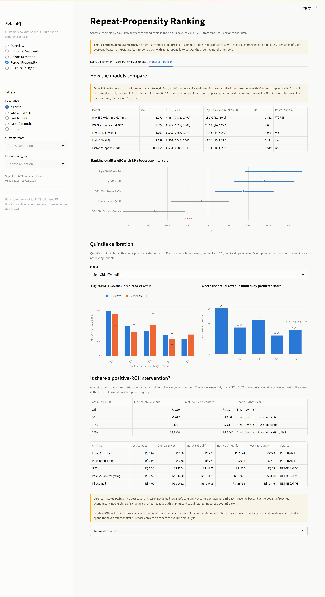
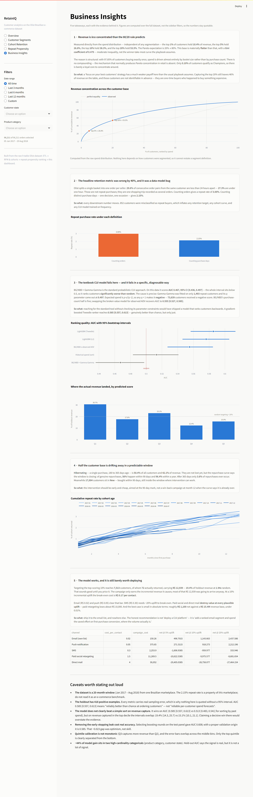
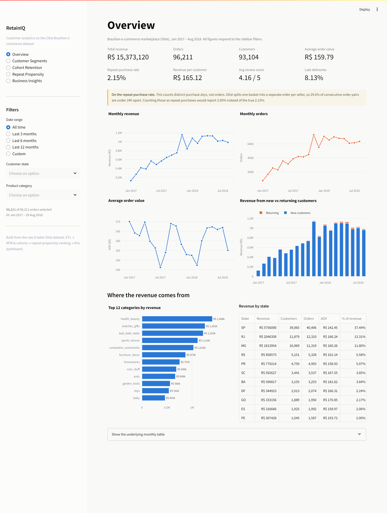
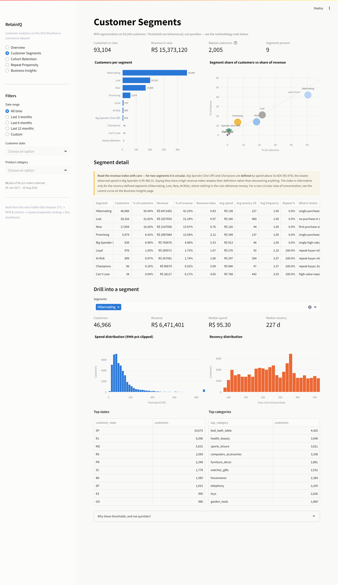
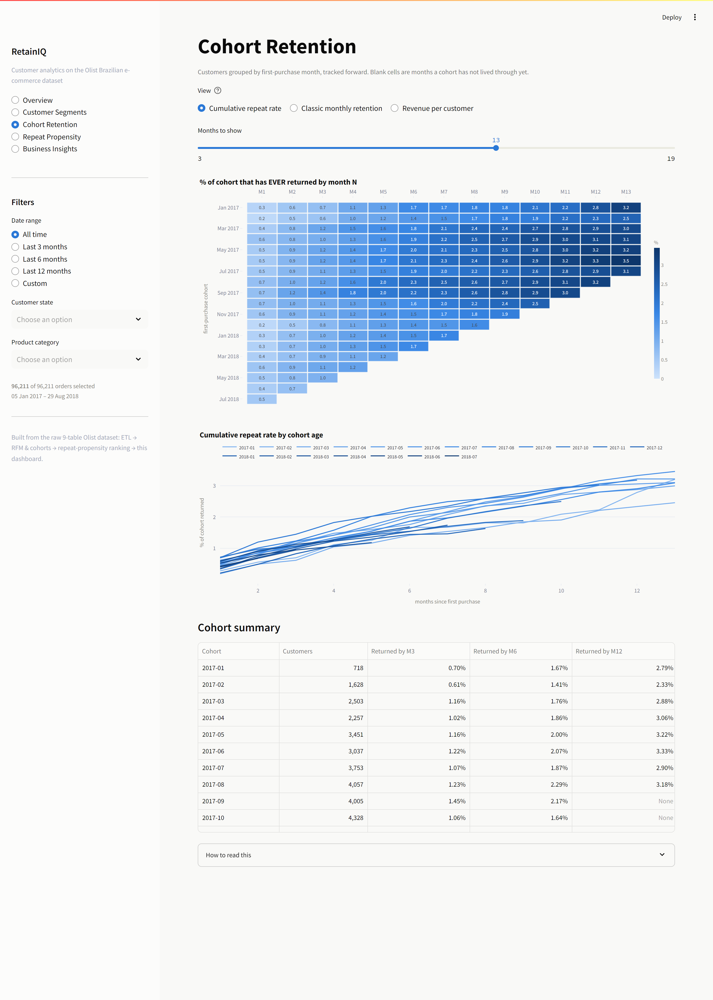
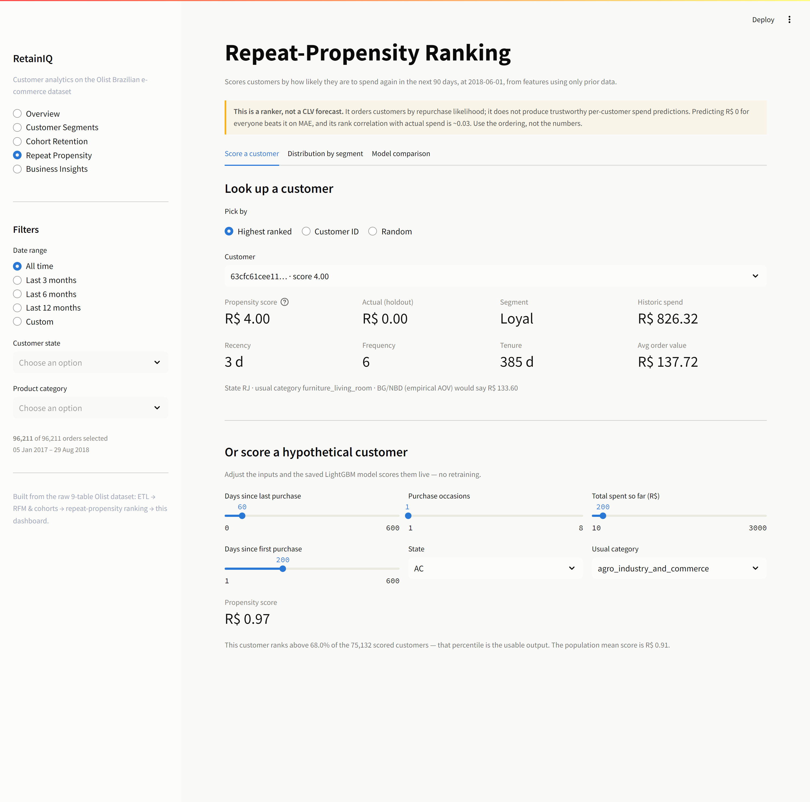

# RetainIQ — customer analytics on a marketplace that barely retains anyone

**Live demo:** _(deploying to Streamlit Community Cloud — link goes here)_

An end-to-end analytics platform built on the raw [Olist Brazilian e-commerce
dataset](https://www.kaggle.com/datasets/olistbr/brazilian-ecommerce): nine
relational CSVs in, a deployed interactive dashboard out. ETL → RFM
segmentation → cohort retention → a predictive model → business
recommendations.

The interesting part is what the data did to the plan.

---

## The premise, stated honestly up front

Olist has a **2.15% repeat purchase rate**. 97.85% of customers buy exactly
once, ever.

That makes it a *bad* dataset for textbook customer-lifetime-value modelling
and an *excellent* test of whether the standard playbook survives contact with
real data. It doesn't. Applied blindly, the conventional approach here produces
a model that ranks customers **backwards**, a segmentation whose headline
insight is circular, and a recommendation that would lose money.

This project is the diagnosis: where each standard technique breaks, why, how
to detect it, and what to use instead. **The headline result is not a model —
it's a finding.**

If you want a project where a CLV model works, this is the wrong dataset. If
you want to see whether someone checks their tools before trusting them, read on.

---

## Business Problem → Approach → Results

### Business Problem

A marketplace operator wants to know: *which customers are worth spending
retention budget on, and how much should we spend?*

### Approach

| Phase | What was built |
|---|---|
| **1. ETL** | Modular pipeline over 9 raw tables (1.55M rows) → validated parquet. 30 automated checks: primary keys, referential integrity, null contracts, revenue reconciliation. Every dropped row logged with a reason. |
| **2. Analytics** | RFM segmentation on behaviourally-derived thresholds (not quintiles — they're undefined here), cohort retention, revenue concentration. |
| **3. Modelling** | BG/NBD + Gamma-Gamma vs. LightGBM (Tweedie) vs. a historical-spend sort, on a leakage-audited time-ordered panel with bootstrap confidence intervals. |
| **4. Decision** | Explicit ROI arithmetic: does acting on the model actually make money? |
| **5. Dashboard** | Five-page interactive Streamlit app reading pre-computed artifacts. |

### Results

**Five findings, in order of how much they'd change a decision.**

#### 1. The headline retention metric was wrong by 40% — and it was a data-modelling bug

Olist splits one shopping basket into **a separate order per seller**. 29.6% of
consecutive order pairs from the same customer are under 24 hours apart; 27.3%
are under one hour. Those aren't repeat purchases — they're one shopping trip
recorded as several orders.

| Definition | Repeat rate |
|---|---:|
| Counting **orders** | 3.00% |
| Counting distinct **purchase days** | **2.15%** |

852 customers were misclassified as repeat buyers. Every downstream number —
retention targets, cohort curves, any model using frequency — moves.

There's a second identity trap in the same dataset: `customer_id` is a
**per-order surrogate key**. The stable person is `customer_unique_id`. Keying
RFM on `customer_id` gives frequency = 1 for all 99k customers and a silently
meaningless model.

#### 2. The textbook CLV model fails — in a specific, diagnosable way

BG/NBD + Gamma-Gamma is the standard probabilistic CLV approach. Here:

**AUC 0.467, 95% CI [0.436, 0.497]** — the entire interval sits *below* 0.5. It
ranks customers **significantly worse than random**.

The cause is precise. Gamma-Gamma was fitted on only 1,493 repeat customers and
its `q` parameter converged to **0.497**. Expected spend is `p·v/(q−1)`, which
is only positive for `q > 1`. So **73,639 customers received a negative
predicted spend.**

Critically, only *half* the model broke. BG/NBD's purchase-count component is
well-behaved (0.002–1.92, all positive). Swapping the broken value model for
observed AOV recovers **AUC 0.555 [0.527, 0.585]**.

A simulation study refined the diagnosis rather than confirming the first
guess: recovering known BG/NBD parameters from synthetic data as the repeat rate
falls shows error growing from 6.6% (45% repeat rate) to 14.1% (2%) — degraded,
but **not collapsed**. So this isn't primarily an identifiability problem. It's
misspecification plus a structural constraint violation. The fitted `b = 0.017`
is the model correctly reporting that essentially everyone churns immediately.

#### 3. Revenue is *less* concentrated than the 80/20 rule predicts

| Customer percentile | Share of revenue |
|---|---:|
| Top 1% | 10.4% |
| Top 5% | 26.8% |
| Top 10% | 38.3% |
| **Top 20%** | **53.5%** |
| Top 50% | 80.8% |

Pareto predicts 80% at the top 20%. This is closer to a **50/80** rule, Gini
**0.479**. The mechanism is structural: with 97.85% single-purchase customers,
spend tracks *basket size*, not purchase count — the compounding that normally
produces Pareto concentration never happens.

This is computed from the spend distribution alone. An earlier version of this
project claimed the "Big Spender" segment had a 5.5x revenue index — but that
segment is *defined* as spend > 3× AOV (R$479.36) and its lowest observed spend
is R$480.31. That claim restated its own definition. It was cut.

#### 4. The best model works — and is still barely worth deploying

| Model | MAE | AUC [95% CI] | Top-10% capture | vs. random |
|---|---:|---|---|---|
| BG/NBD + Gamma-Gamma | 1.292 | 0.467 [0.436, 0.497] | 13.1% | **WORSE** |
| BG/NBD × observed AOV | 2.022 | 0.555 [0.527, 0.585] | 20.9% | yes |
| **LightGBM (Tweedie)** | 1.790 | **0.585 [0.557, 0.613]** | 19.4% | yes |
| LightGBM (L2) | 2.189 | 0.576 [0.546, 0.606] | 21.1% | yes |
| Historical spend (sort) | 164.2 | 0.513 [0.483, 0.541] | 15.1% | no |

**Read MAE with suspicion.** The target is 99.44% zeros, so "predict zero for
everyone" scores **MAE 0.890** — better than every real model. MAE rewards
giving up. That's why every headline metric here carries a bootstrap CI and the
trivial baselines are printed alongside.

#### 5. The ROI arithmetic says: email only

Targeting the top-scoring 10% reaches 7,513 customers, of whom 72 returned,
carrying **R$12,939** (19.4% of holdout revenue, 1.94× random). A campaign earns
only the *incremental* revenue it causes — most of that would have arrived
anyway. Break-even at a 10% incremental uplift is **R$0.17 per contact**.

| Channel | Cost/contact | Net @ 10% uplift |
|---|---:|---:|
| Email (own list) | R$0.02 | **+R$1,144** |
| Push notification | R$0.05 | +R$918 |
| SMS | R$0.30 | −R$960 |
| Paid social retargeting | R$1.50 | −R$9,976 |
| Direct mail | R$4.00 | −R$28,758 |

**Best case: ~R$1,144 net against a R$15.4M revenue base — 0.0074% of revenue.**

The honest recommendation is not "deploy a CLV platform." It's *"add a ranked
email segment, and spend the saved effort on first-purchase conversion, where
the volume actually is."*

---

## The dashboard

Five pages, genuinely interactive — date-range presets, state and category
filters, and segment drill-downs all recompute from the underlying data rather
than swapping cached images.

### Model comparison, with uncertainty made visible



Every metric carries a bootstrap interval. AUC is drawn as an **interval, not a
bar**, against the 0.5 random line — BG/NBD's entire interval sits below it.
Calibration is binned into quintiles with error bars, and the non-monotonic
middle is shown as-is rather than smoothed into something cleaner than the data
supports. The ROI section states the verdict in prose, not just a table.

### Business insights



### Overview, segments and cohorts

| | |
|---|---|
|  |  |
|  |  |

The cohort page defaults to a **cumulative** repeat view. Classic month-by-month
retention is available and is nearly empty — every cell near 0.3% — which is
itself the finding: at a 2.15% repeat rate the conventional retention matrix
carries almost no signal.

---

## What this project does *not* claim

Stated plainly, because a portfolio project that only lists strengths isn't
credible:

- **It is a repeat-propensity ranker, not a CLV prediction system.** It orders
  customers by repurchase likelihood. It does not produce trustworthy
  per-customer spend forecasts — rank correlation with actual spend is ~0.03.
- **The holdout has 418 positive examples.** Every metric carries real sampling
  error. Nothing here is quoted without a 95% interval.
- **It does not clearly beat a simple sort on revenue capture.** It wins on AUC
  (intervals don't overlap vs. historical spend), but top-decile revenue capture
  is 19.4% [14.3, 25.7] vs. 15.1% [10.1, 21.1] — those overlap. Claiming a
  decisive win there would overstate the evidence.
- **Quintile calibration is not monotonic.** Q3 captures more revenue than Q2.
  Only the top quintile is clearly separated from the bottom.
- **~44% of model gain sits in two high-cardinality categoricals** (product
  category, customer state). Held-out AUC says the signal is real; it isn't a
  lot of signal.
- **This is one 20-month window from one Brazilian marketplace.** The 2.15%
  repeat rate is a property of *this* marketplace, not an e-commerce benchmark.
- **No unit tests or CI.** Correctness is enforced by 30 in-pipeline validation
  checks, a runtime leakage assertion, and an automated dashboard smoke test —
  but that is not the same thing as a test suite.

---

## Methodology notes worth defending in an interview

### Why these RFM thresholds, and not quintiles?

**Quintiles are undefined here.** 97.85% of customers have frequency 1, so four
of five frequency quintiles would contain identical customers. The cuts are
behavioural instead:

- **Recency — 90 / 180 / 365 days.** Conventional business horizons (quarter,
  half-year, year), sanity-checked against the observed repurchase curve: 56.0%
  of genuine repurchases occur within 90 days, 76.9% within 180, 96.4% within
  365. Past a year only 3.6% ever occur, which is what makes "Lost" defensible.
  *(These are round numbers validated against the curve — not inflection points
  the data picked out. The curve is a smooth decay.)*
- **Frequency — distinct purchase days**, for the basket-splitting reason above.
- **Monetary — 1× and 3× AOV** (R$159.79 / R$479.36). AOV multiples are
  business-interpretable, and the 3× cut lands near the 95th percentile.

### How leakage is prevented

Two distinct surfaces, both guarded at runtime:

- **Target leakage** — `build_train_test()` raises if any training target
  window closes after the validation origin, or the validation window after the
  test origin.
- **Feature leakage** — this one was real and was caught in review. `avg_review`,
  `min_review`, `avg_delivery_days` and `late_rate` were originally filtered on
  `order_purchase_timestamp` — but reviews and deliveries happen *after*
  purchase. At the test origin that contaminated 2,456 of 75,132 scored
  customers (3.27%). Each measure is now masked by its **own event timestamp**,
  and `assert_no_feature_leakage()` re-verifies it from the data on every run.

Panel design, all enforced in code:

```
train  2017-06-01, 2017-08-01, 2017-10-01, 2017-12-01   90,111 rows,  761 positives
valid  2018-03-01                                        55,267 rows,  383 positives
test   2018-06-01                                        75,132 rows,  418 positives
```

Boosting rounds are selected on **validation**, never on test. Fixing that cost
real accuracy — AUC fell 0.608 → 0.585. That 0.023 was optimism, not skill.

### Why Tweedie?

The target is spend over a fixed window: a point mass at zero (99.44%) plus a
continuous positive part — a compound Poisson-Gamma, i.e. Tweedie with
1 < p < 2. Measured honestly, its advantage over plain L2 here is **calibration,
not discrimination** (AUC 0.585 vs 0.576, overlapping). On this data the framing
matters more than the objective.

---

## Repo structure

```
retainiq/                  Library code (importable, no notebooks)
  config.py                Paths + every tunable business rule, with rationale
  data/                    Source manifest, schema specs, downloader
  pipeline/                load → clean → build → run_etl
  validation/              30 checks: PKs, FKs, nulls, reconciliation
  analytics/               RFM, cohorts, headline metrics
  models/                  features, bgnbd, gbm, evaluate, roi, train_clv
  dashboard_export.py      Slim tables for deployment
app/                       Streamlit UI (theme, charts, 5 pages)
scripts/                   CLI entrypoints
data/dashboard/            Committed slim parquets (17 MB) — deploy reads these
artifacts/                 clv_model.joblib (129 KB, committed)
```

`data/raw/`, `data/processed/` and `.venv/` are gitignored. The dashboard runs
from the committed `data/dashboard/` + `artifacts/` alone — **a fresh clone
serves the app without downloading or recomputing anything.**

---

## Running it locally

Requires **Python 3.12** (the stack is pinned to numpy 1.26; see below).

```bash
git clone https://github.com/yukta1103/RetainIQ.git
cd RetainIQ
python -m venv .venv
```

```bash
.venv\Scripts\python.exe -m pip install -r requirements.txt
```
_(macOS/Linux: `.venv/bin/python -m pip install -r requirements.txt`)_

Then launch the dashboard — no data download needed:

```bash
.venv\Scripts\python.exe -m streamlit run streamlit_app.py
```

Opens at http://localhost:8501.

### Rebuilding everything from raw data

Optional — takes ~6 minutes and downloads 126 MB. No Kaggle account required;
the raw CSVs are pulled from a public HuggingFace mirror with byte-size
integrity checks.

```bash
.venv\Scripts\python.exe scripts\download_data.py
```
```bash
.venv\Scripts\python.exe scripts\run_etl.py
```
```bash
.venv\Scripts\python.exe scripts\run_analytics.py
```
```bash
.venv\Scripts\python.exe scripts\train_clv.py
```
```bash
.venv\Scripts\python.exe scripts\export_dashboard_data.py
```

Every stage prints its own validation output. `run_etl.py` exits non-zero if any
check fails. Add `--quiet` to skip the per-table schema dump.

### Verifying the dashboard

```bash
.venv\Scripts\python.exe -m pip install -r requirements-dev.txt
```
```bash
.venv\Scripts\python.exe scripts\smoke_dashboard.py --url http://localhost:8501
```

Visits every page, exercises every filter and tab, and fails on any Streamlit
exception, empty chart, or stale "CLV prediction" wording.

### A note on pinned versions

`requirements.txt` is pinned to a coherent **numpy 1.26** stack. This is
deliberate: lightgbm 4.7 with numpy 2.5 segfaults on Windows
(access violation in `LGBM_DatasetSetField`), and pandas 2.2.3 is a numpy-1.x
era build. Installing "latest of everything" breaks the training pipeline.

---

## Tech stack

Python 3.12 · pandas · PyArrow · scikit-learn · LightGBM · lifetimes · SciPy ·
Streamlit · Plotly · Playwright (dev)

## Data

[Olist Brazilian E-Commerce Public Dataset](https://www.kaggle.com/datasets/olistbr/brazilian-ecommerce)
(CC BY-NC-SA 4.0), ~100k orders, Sept 2016 – Oct 2018. This project analyses
Jan 2017 – Aug 2018; the tails are excluded because 2016 holds ~300 orders total
and the delivered-only filter truncates the final weeks artificially.
